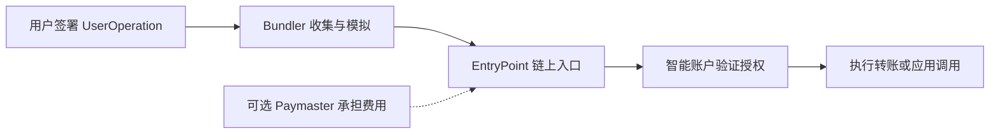
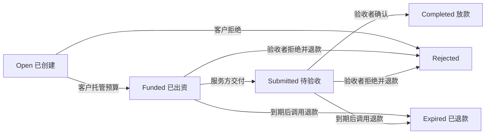

# 常用 ERC / EIP 标准

来源：[ERC / EIP 标准](https://eips.ethereum.org/erc)。

## 标准速览与易混点

| 容易混淆的概念 | 正确理解 |
| --- | --- |
| [ERC-20](#erc20) | `approve` 设置权限，`transferFrom` 才实际移动代币 |
| [EIP-712](#eip712) | 规定结构化签名格式 |
| [ERC-2612](#erc2612) | 规定代币验证 [`EIP-712`](#eip712) 的签名授权通过后，授权额度行为 |
| [ERC-721](#erc721) | 按独立编号记拥有者 |
| [ERC-1155](#erc1155) | 按资产编号与地址记拥有数量 |
| [ERC-4626](#erc4626) | assets 是底层资产数量， shares 是拥有的金库份额 |
| [ERC-165](#erc165) | 查询合约是否支持声明的接口 |
| [ERC-2981](#erc2981) | 查询版税收款人和金额，付款由交易流程落实 |
| [ERC-1271](#erc1271) | 询问合约账户是否认可签名 |
| [ERC-4337](#erc4337) |组织账户操作流程 |
| [EIP-7702](#eip7702) | 在原 EOA 地址的代码位置写入指向 B 的特殊标记。调用 A 时，EVM 加载 B 的代码，并在 A 的账户环境中处理本次 calldata |
| [ERC-8004](#erc8004) | 记录 Agent 身份、评价与验证信号 |
| [x402](#x402) | 用协议消息衔接服务请求与付款 |
| [ERC-8183](#erc8183) | 将任务、托管预算、验收和结算串起来 |

---

## 一、DEX（Uniswap）

可以先想象一个操作：**我拿代币换币，或者拿两种代币提供流动性。**
[`ERC-20`](#erc20) 负责代币接口，[`ERC-2612`](#erc2612) 解决签名授权，[`EIP-712`](#eip712) 规定签名内容怎么组织，[`ERC-721`](#erc721) 则可以表示各不相同的流动性仓位。

<a id="erc20"></a>
### 1. ERC-20：给可互换的代币统一一套操作方式，同质化规范

**解决什么问题？**

同一种代币中，你的 1 枚和我的 1 枚通常没有身份区别。[`ERC-20`](#erc20) 统一“查余额、转账、授权”等接口，让钱包和 DEX 不必为每种代币重新写一套操作代码。

**核心字段**

| 字段 / 数据 | 解释与作用 |
| --- | --- |
| `name`、`symbol` | 全名与简称，用于展示；原始 [ERC-20](#erc20) 中属于可选信息 |
| `decimals` | 展示时的小数位数；也是可选信息，不改变链上整数计算 |
| `totalSupply` | 已发行且尚未销毁的代币总量 |


**核心函数**

| 函数 | 解释与作用 |
| --- | --- |
| `name()`、`symbol()`、`decimals()` | 读取展示信息 |
| `totalSupply()`、`balanceOf(owner)` | 查询总量或个人余额 |
| `transfer(to, amount)` | 调用者把自己的代币转出去 |
| `approve(spender, amount)` | 设置代扣额度；再次调用会覆盖原额度 |
| `allowance(owner, spender)` | 查询授权还剩多少 |
| `transferFrom(from, to, amount)` | 调用者依据授权，从 `from` 转币给 `to` |

**放进 DEX 看一遍**

假设某代币 `decimals = 6`，100 枚在链上的数量就是 `100 × 10^6`。你先允许 Router 使用这个数量，Router 才能在交换时调用 `transferFrom` 收款。`approve` 本身只记下权限，余额不会因此减少。

`Transfer` 记录转账，`Approval` 记录授权。`mint()`、`burn()` 并不是 [`ERC-20`](#erc20) 规定的统一实现的函数，项目可以自行设计。

来源：[ERC-20 官方规范](https://eips.ethereum.org/EIPS/eip-20)。

<a id="erc721"></a>
### 2. ERC-721：每件资产有自己的编号和主人

**解决什么问题？**

两张不同座位的票不能只记成“我有两张票”，还要知道具体是哪两张。[`ERC-721`](#erc721) 用 `tokenId` 区分资产，并记录每个编号属于谁。

**核心字段**

| 字段 / 数据 | 解释与作用 |
| --- | --- |
| `tokenId` | 当前 NFT 合约中的资产编号；不同合约可以有相同编号 |
| `owner` | 这件 NFT 当前的主人 |
| `approved` | 获准操作这一件 NFT 的地址 |
| `operator` | 获准操作某个持有人在该合约下全部 NFT 的地址 |
| `tokenURI` | 元数据入口，可以指向图片、描述或仓位说明；属于可选扩展 |

**核心函数**

| 函数 | 解释与作用 |
| --- | --- |
| `ownerOf(tokenId)` | 查询某一件 NFT 的主人 |
| `balanceOf(owner)` | 查询此人有几件 NFT，不直接返回编号列表 |
| `approve(to, tokenId)`、`getApproved(tokenId)` | 设置、查询单件授权 |
| `setApprovalForAll(operator, approved)`、`isApprovedForAll(owner, operator)` | 设置、查询该合约下的整体授权 |
| `transferFrom(from, to, tokenId)` | 转移指定 NFT |
| `safeTransferFrom(from, to, tokenId[, data])` | 转移时检查接收合约能否接收 NFT |
| `tokenURI(tokenId)` | 查询元数据地址，可选扩展 |

接收合约通过 `onERC721Received` 回答“我能接收”。这个检查不意味着它一定提供取回功能。[ERC-721](#erc721) 也未统一规定公开的 `mint()` 接口。

来源：[ERC-721 官方规范](https://eips.ethereum.org/EIPS/eip-721)。

**为什么 Uniswap 会用 NFT？**

Uniswap V3 的两笔流动性仓位可能具有不同的价格区间、流动性数量和手续费记录。`NonfungiblePositionManager` 用 NFT 包装这些仓位，并通过 `positions(tokenId)` 读取 `token0`、`token1`、`fee`、`tickLower`、`tickUpper`、`liquidity` 等信息。

这里的仓位字段是 Uniswap 业务设计，不属于 [ERC-721](#erc721) 通用标准。[Uniswap V3 仓位管理器源码](https://github.com/Uniswap/v3-periphery/blob/main/contracts/NonfungiblePositionManager.sol)

<a id="eip712"></a>
### 3. EIP-712：把签名内容写成有字段、有类型的表单

**解决什么问题？**

钱包如果只让你签一串十六进制，很难判断自己答应了什么。[EIP-712](#eip712) 规定结构化数据的编码和签名方式，让钱包有机会展示“谁、授权给谁、多少、哪个合约”等内容。

**核心字段**

| 字段 | 解释与作用 |
| --- | --- |
| `types` | 表单结构：每个字段叫什么、是什么类型 |
| `primaryType` | 这次签名的主结构，例如 `Permit` 或某种订单 |
| `message` | 真正要签的具体内容 |
| `domain.name`、`domain.version` | 签名所对应的应用 / 协议名称和版本 |
| `domain.chainId` | 适用的链，用于区分网络 |
| `domain.verifyingContract` | 将来核验签名的合约地址 |
| `domain.salt` | 可选的额外域区分值 |

域字段按协议需要选用，并非所有项目都包含全部字段。

**核心方法与过程**

| 方法 / 概念 | 解释与作用 |
| --- | --- |
| `eth_signTypedData` | 钱包 RPC 签名入口 |
| `hashStruct(message)` | 把结构类型和内容合成摘要 |
| `domainSeparator` | 把签名适用环境合成摘要 |
| 最终签名摘要 | 将固定前缀、域摘要、消息摘要组合后哈希 |

```text
digest = keccak256(0x1901 || domainSeparator || hashStruct(message))
```

这里的 `hashStruct` 是规范中的计算定义，不代表每个合约都必须公开同名函数。协议再用适当的验签方式核验 `digest`。

来源：[EIP-712 官方规范](https://eips.ethereum.org/EIPS/eip-712)。

<a id="erc2612"></a>
### 4. ERC-2612：用签名表达“我允许你花这些代币”

**解决什么问题？**

普通流程经常需要先发一笔 `approve` 交易，再做交换。[ERC-2612](#erc2612) 给代币增加 `permit`：你先签一张授权书，别人也能把它提交上链，让代币合约认可这份授权。

**核心字段**

| 字段 | 通俗解释与作用 |
| --- | --- |
| `owner` | 代币拥有者，也是签名者 |
| `spender` | 被允许代扣的人或合约 |
| `value` | 允许代扣的数量，以最小单位表示 |
| `nonce` | 拥有者当前使用的签名序号，防止同一签名重复生效 |
| `deadline` | 最晚什么时候可以提交这份签名 |
| `v`、`r`、`s` | 签名的组成部分，用于核验身份 |
| `DOMAIN_SEPARATOR` | 签名所属环境的摘要，通常绑定链和代币合约 |

**核心函数**

| 函数 | 解释与作用 |
| --- | --- |
| `permit(owner, spender, value, deadline, v, r, s)` | 验签后设置额度、递增 nonce，并发出 `Approval` |
| `nonces(owner)` | 签名前读取正确的序号 |
| `DOMAIN_SEPARATOR()` | 读取签名的域分隔符 |

**实际理解**

**和 [`EIP-712`](#eip712) 连起来理解：** [`EIP-712`](#eip712) 负责授权书的格式，[`ERC-2612`](#erc2612) 规定使用参数需要携带 [`EIP-712`](#eip712) 加密的这份授权书，合约验证授权书，生效后如何修改代币额度（因为 [`ERC-2612`](#erc2612) 下一步实现是授权）。

但是防止同一订单重复执行的 `nonce`、取消状态、有效期等，仍需业务协议自己设计；[`EIP-712`](#eip712) 不会自动补上。

当然可以继承 [`EIP-712`](#eip712) 做自己的逻辑，配合下面这个恢复公钥地址的逻辑
```solidity
     bytes32 digest = _hashTypedDataV4(keccak256(abi.encode(
      keccak256("Mail(address to,string contents)"),
      mailTo,
      keccak256(bytes(mailContents))
      )))
     address signer = ECDSA.recover(digest, signature)
```

线下先签名，但是不发送交易。使用签名代替原来的 `approve` 的交易。

你签名允许 Router 花 100 枚代币，Router 可以在同一笔业务交易里先处理 `permit`，再交换。签名本身不花链上 Gas，但提交和执行交易仍有人付 Gas。

`permit` 只授予额度，不直接转币；代币本身必须支持该接口。`deadline` 限制的是**签名提交时间**，已生效的额度不会在这个时间点自动到期。`nonce` 在签名内容里，提交时由合约读取，不是 `permit` 的独立参数。

来源：[ERC-2612 官方规范](https://eips.ethereum.org/EIPS/eip-2612)。

**Uniswap 补充：Permit2 是另一套机制。** 它是独立合约，可以服务于未实现 [`ERC-2612`](#erc2612) 的 [`ERC-20`](#erc20)。通常先给 Permit2 一次代币授权，再通过签名分配后续支出权限。看到 Permit2 时，不能直接套用上面这组 `permit` 参数。[Uniswap Permit2 文档](https://developers.uniswap.org/docs/protocols/permit2/overview)


---


## 二、借贷与收益（Unitas）

先把“资产、存款凭证、收益份额”分清楚。它们可能都表现为代币，但记录的东西不同。

主要由这几种协议

| 协议 | 解释与作用 |
| --- | --- |
| [`ERC-20`](#erc20) | 质押的资产，就是金库中的 asset |
| [`EIP-712`](#eip712) | 约定线下的签名方式 |
| [`ERC-2612`](#erc2612) | 通过提前线下签名，交易中授权代币 |
| [`ERC-4626`](#erc4626) | 金库的标准实现，本身也是实现 [`ERC-20`](#erc20), 表示份额（股票） |


<a id="erc4626"></a>
### 1. ERC-4626：统一收益金库的“存钱换份额、退份额取钱”

**解决什么问题？**

若不同理财产品如果各自设计存取接口，三方平台集成起来就会很麻烦。

[`ERC-4626`](#erc4626) 统一单一 [`ERC-20`](#erc20) 底层资产金库的存入、赎回、报价和额度查询，**金库份额本身继承 [`ERC-20`](#erc20) 接口**， 代币就是 share。

**核心字段**

| 字段 / 数据 | 解释与作用 |
| --- | --- |
| `asset`、`assets` | 前者指底层代币，后者通常指它的数量 |
| `shares` | 金库份额数量，表示对金库资产的份额权益 |
| `totalAssets` | 金库管理的底层资产总量，不一定都闲置在合约余额中 |
| `totalSupply` | 份额总量，单位是 shares |
| `receiver` | 接收新份额或提取资产的地址 |
| `owner` | 提取时被扣除份额的持有人；可以与 receiver 不同 |

**核心函数：先记住四个操作**

| 函数 | 你先确定什么 | 合约计算、返回什么 |
| --- | --- | --- |
| `deposit(assets, receiver)` | 我要存多少资产 | 给你多少份额，返回 shares |
| `mint(shares, receiver)` | 我要拿多少份额 | 你应支付多少资产，返回 assets |
| `withdraw(assets, receiver, owner)` | 我要取多少资产 | 需扣多少份额，返回 shares |
| `redeem(shares, receiver, owner)` | 我要退多少份额 | 能拿多少资产，返回 assets |

**查询函数**

| 函数 | 解释与作用 |
| --- | --- |
| `asset()`、`totalAssets()` | 查询底层代币与管理资产总量 |
| `convertToShares(assets)`、`convertToAssets(shares)` | 理想条件下的份额换算，不包含费用 |
| `previewDeposit`、`previewMint`、`previewWithdraw`、`previewRedeem` | 对应四种操作的当前报价，包含对应费用；不代表已检查操作限额 |
| `maxDeposit`、`maxMint`、`maxWithdraw`、`maxRedeem` | 查询某地址当前允许操作的上限 |

**用数字理解**

先忽略费用和舍入，假设金库共有 1200 枚资产(`asset`)和 1000 份份额(`share`)，那么每份对应 1.2 枚资产。你 `deposit(120)` 可以拿到 100 份；`redeem(100)` 可以拿回 120 枚资产。

实际计算要按具体实现和整数舍入处理；通常发给用户的数量向下取整、用户需支付的数量向上取整。报价也会随金库状态改变。[`ERC-4626`](#erc4626) 统一接口，并不保证收益为正。

来源：[ERC-4626 官方规范](https://eips.ethereum.org/EIPS/eip-4626)。

---

## 三、NFT 市场（OpenSea）

主要由这几种协议

| 协议 | 解释与作用 |
| --- | --- |
| [`EIP-712`](#eip712) | 约定线下的签名方式 |
| [`ERC-721`](#erc721) | 非同质化代币 |
| [`ERC-165`](#erc165) |  查询合约支持的接口|
| [`ERC-1155`](#erc1155) | 同一个合约可以定义多种资产 |
| [`ERC-2981`](#erc2981) | 版税相关的约束 |
| [`ERC-1271`](#erc1271) |  解决合约无法签名，但是需要验证操作是否有效 |


<a id="erc165"></a>
### 1. ERC-165：先问合约“你支持哪些接口？”

**解决什么问题？**

拿到一个合约地址后，需要判断应该按哪套接口与它交互。[`ERC-165`](#erc165) 提供标准化的接口查询方式。

**核心字段与函数**

| 字段 / 函数 | 解释与作用 |
| --- | --- |
| `interfaceId` | 4 字节的接口编号，由接口函数选择器异或得到 |
| `supportsInterface(interfaceId)` | 返回是否支持这个接口 |
| `0x01ffc9a7` | [`ERC-165`](#erc165) 自身的接口编号 |
| `0x80ac58cd` | [`ERC-721`](#erc721) 基础接口编号 |
| `0xd9b67a26` | [`ERC-1155`](#erc1155) 基础接口编号 |
| `0x2a55205a` | [`ERC-2981`](#erc2981) 版税接口编号 |
| `0xffffffff` | 无效编号，合规实现必须返回 false |

它像一份合约自报的能力清单。返回 true 方便程序选择调用方式，但不能证明合约实现正确或行为可信；[`ERC-20`](#erc20) 基础标准也不要求实现 [`ERC-165`](#erc165)。

来源：[ERC-165](https://eips.ethereum.org/EIPS/eip-165)、[ERC-721](https://eips.ethereum.org/EIPS/eip-721)、[ERC-1155](https://eips.ethereum.org/EIPS/eip-1155)、[ERC-2981](https://eips.ethereum.org/EIPS/eip-2981) 官方规范。


把一次买卖拆开：先识别资产，再取得转移授权；卖家认可订单，买家履约后完成资产交换。版税信息和合约钱包验签是这条流程里的额外能力。

<a id="erc1155"></a>
### 2. ERC-1155：一个合约管理多种资产，每种资产都能有自己的数量

**解决了什么问题？**

游戏里同时有金币、药水和装备。如果每种都部署一个合约，会很零散。

[`ERC-1155`](#erc1155) 允许一个合约管理多个 `id`，每个地址在每个 `id` 下都有余额，也支持批量转移。

**核心字段**

| 字段 / 数据 | 通俗解释与作用 |
| --- | --- |
| `id` | 资产种类 / 编号，例如药水是 2、门票是 3、武器是 4 |
| `amount` / `value` | 此次操作该 id 的数量 |
| `balanceOf(account, id)` | 某人持有这种资产多少份 |
| `ids[]`、`amounts[]` | 批量处理的编号与数量，按位置一一对应 |
| `operator` | 获准代操作该合约下资产的地址 |
| `uri(id)` | 该编号的元数据入口，属于元数据扩展 |

**核心函数**

| 函数 | 解释与作用 |
| --- | --- |
| `balanceOf(account, id)` | 查询一个余额 |
| `balanceOfBatch(accounts, ids)` | 批量查询每对地址与 id 的余额 |
| `setApprovalForAll(operator, approved)`、`isApprovedForAll(account, operator)` | 管理和查询整体授权 |
| `safeTransferFrom(from, to, id, amount, data)` | 转移一种资产的指定数量 |
| `safeBatchTransferFrom(from, to, ids, amounts, data)` | 一次转移多种资产 |
| `uri(id)` | 查询元数据，扩展接口 |

如果接受资产的是合约，需要用 `onERC1155Received` / `onERC1155BatchReceived` 来确认接收资产。没有这个确认，通常会造成资产的永久锁定。

比如同一个合约里，`id=1` 可以有很多份金币，`id=2` 也可以只发行一件装备。

唯一性还取决于项目的发行规则。基础标准没有 [`ERC-721`](#erc721) 那样的单个 `approve` 接口。

来源：[ERC-1155 官方规范](https://eips.ethereum.org/EIPS/eip-1155)。


<a id="erc2981"></a>
### 3. ERC-2981：告诉市场“这笔交易的版税给谁、给多少”

**解决了什么问题？**

不同 NFT 项目表达版税的方式如果不同，市场就很难统一读取。[`ERC-2981`](#erc2981) 给版税查询规定了统一入口。

**核心字段**

| 字段 | 通俗解释与作用 |
| --- | --- |
| `tokenId` | 正在计算哪件 NFT 的版税 |
| `salePrice` | 这次成交价格 |
| `receiver` | 应接收版税的地址 |
| `royaltyAmount` | 按这次成交价计算出的版税金额 |

**核心函数**

`royaltyInfo(tokenId, salePrice)` 返回 `(receiver, royaltyAmount)`；`supportsInterface(0x2a55205a)` 用于发现该能力。

例如，成交价 100 USDC、版税比例 5%，查询结果可以是创作者地址和 5 USDC 对应的最小单位数量。`royaltyAmount` 与输入 `salePrice` 使用相同计价单位。

**查询不会自动付款。** [ERC-2981](#erc2981) 没有把每次 NFT 转账都强制变成版税扣款。`setRoyalty()` 等设置方法也不是它规定的统一接口。OpenSea 的创作者费用执行还涉及平台规则、Seaport hooks、ERC721-C / ERC1155-C 等机制，不能仅凭实现 [ERC-2981](#erc2981) 就认定任何交易都会强制收版税。

来源：[ERC-2981 官方规范](https://eips.ethereum.org/EIPS/eip-2981)、[OpenSea 创作者费用执行文档](https://docs.opensea.io/docs/creator-fee-enforcement)。

<a id="erc1271"></a>
### 4. ERC-1271：让合约钱包回答“这份签名我认不认”

**解决什么问题？**

核心就是解决：合约账户没有私钥，无法像普通钱包（EOA）那样用私钥生成 ECDSA 签名，外部合约或系统仍然需要判断“这个签名是否可以代表这个合约账户的授权”。

**核心字段**

| 字段 | 通俗解释与作用 |
| --- | --- |
| `hash` | 需要核验的消息摘要，例如订单摘要 |
| `signature` | 钱包能理解的签名数据，可包含多签证明 |
| 返回值 `0x1626ba7e` | 固定成功标识，表示钱包认可这份签名 |

**核心函数**

`isValidSignature(bytes32 hash, bytes signature) → bytes4`。

应用调用的是**签名者对应的合约钱包**。钱包按自身规则检查后返回成功标识；这个函数不能修改状态。它没有统一规定钱包内部必须是几个人签名、怎样保存 owner，也没有规定所有签名都得是 65 字节。

例子：一个三人管理的钱包要求至少两人同意卖出 NFT。两人的签名打包后，市场询问钱包，钱包确认符合规则，才认为该订单获得授权。

[`EIP-712`](#eip712) 决定“订单摘要怎么构造”，[`ERC-1271`](#erc1271) 决定“合约账户是否认可”。签名通过也不保证订单仍可成交，还要检查资产、授权、有效期和订单状态。
来源：[ERC-1271 官方规范](https://eips.ethereum.org/EIPS/eip-1271)、[Seaport 签名与订单模型](https://docs.opensea.io/docs/seaport-models)。

---


## 四、钱包（MetaMask）

先区分两个层面：[`ERC-4337`](#erc4337) 规定用户操作如何被收集、验证和执行；[`EIP-7702`](#eip7702) 让已有 EOA 地址能够使用委托代码。它们可以组合使用。

MetaMask 的 Smart Accounts Kit 提供了相关接入示例，但具体能力仍取决于所用账户实现和网络。[MetaMask EIP-7702 接入示例](https://github.com/MetaMask/metamask-docs/blob/main/smart-accounts-kit/get-started/smart-account-quickstart/eip7702.md)

<a id="erc4337"></a>
### 1. ERC-4337：把账户的授权和执行规则交给程序

**解决什么问题？**

应用希望支持批量操作、不同的签名规则或 Gas 代付。[`ERC-4337`](#erc4337) 让用户提交 `UserOperation`，由 Bundler 打包，通过 `EntryPoint` 调用智能账户验证并执行。具体钱包功能由账户代码实现。



**核心字段：这里按 RPC 常见的拆分形式理解**

| 字段 | 解释与作用 |
| --- | --- |
| `sender` | 要执行操作的智能账户地址 |
| `nonce` | 防止同一操作被重复使用 |
| `callData` | 传给账户的执行指令；目标与操作内容通常编码在里面 |
| `factory`、`factoryData` | 首次创建账户等所需信息；7702 账户有相应特殊处理 |
| `callGasLimit`、`verificationGasLimit`、`preVerificationGas` | 执行、验证和额外处理的 Gas 预算 |
| `maxFeePerGas`、`maxPriorityFeePerGas` | Gas 价格限制 |
| `paymaster`、`paymasterData` | 可选代付方及其验证数据；还有对应 Gas 限额 |
| `signature` | 供账户验证授权的签名数据 |

链上传给 EntryPoint 时会使用 `PackedUserOperation`，例如把部分字段组合成 `initCode`、`accountGasLimits`、`gasFees`、`paymasterAndData`。集成时必须匹配所用 EntryPoint 版本。

**核心接口**

| 接口及所在位置 | 解释与作用 |
| --- | --- |
| `eth_sendUserOperation(...)`，Bundler RPC | 接收用户操作 |
| `handleOps(ops, beneficiary)`，EntryPoint | 链上处理一批操作，结算费用 |
| `validateUserOp(userOp, userOpHash, missingAccountFunds)`，账户 | 检查授权并处理所需预付资金 |
| `validatePaymasterUserOp(...)`，Paymaster | 判断是否愿意为本次操作付费 |
| `postOp(...)`，Paymaster | 按配置在执行后处理计费等事项 |

例如“一次确认完成授权与交换”可以由账户批量执行实现；“用户不用自己准备 Gas 币”可以由代付服务支持。两者都需要相应实现，标准不会让 Gas 成本消失。

来源：[ERC-4337 官方规范](https://eips.ethereum.org/EIPS/eip-4337)。


<a id="eip7702"></a>
### 2. EIP-7702：让已有 EOA 地址使用智能账户代码

**解决什么问题？**

用户希望保留现有地址，同时获得批量操作等能力。[`EIP-7702`](#eip7702) 允许 EOA 签署代码委托授权：这个账户之后执行指定地址上的代码，状态和资产仍在原账户上下文中。

[`EIP-7702`](#eip7702) 在原 EOA 地址 A 的代码位置写入指向 B 的特殊标记。调用 A 时，EVM 加载 B 的代码，并在 A 的账户环境中处理本次 calldata。

**核心字段**

| 字段 | 解释与作用 |
| --- | --- |
| `authorization_list` | 新交易类型携带的授权列表 |
| `chain_id` | 授权适用链；0 有跨链适用的特殊语义 |
| `address` | 被委托执行的代码地址，不是收款地址 |
| `nonce` | 授权账户的序号，用于核验本次授权 |
| `y_parity`、`r`、`s` | 代码委托授权的签名数据 |
| `0xef0100 || address` | 写入账户的委托标记，让执行器找到目标代码 |

**核心机制：这里没有一组 [`ERC-20`](#erc20) 式业务函数**

| 机制 | 解释与作用 |
| --- | --- |
| 类型 `0x04` 的交易 | 携带代码委托授权 |
| 授权验证与写入 | 核验签名和 nonce 后设置委托 |
| 后续调用账户 | 使用目标代码，在原账户上下文执行 |
| 新授权指向零地址 | 清除账户的代码委托 |

**特别要记住：委托会持续存在，直到被更新或清除。** 它不是交易结束后自动失效的临时开关；后续交易执行失败，也不会回滚已经处理成功的代码委托。

7702 授权签的是代码委托目标等信息，后续具体操作还需要委托代码正确检查权限。这个授权也不等同于 [`ERC-20`](#erc20) 的 `approve` 或 [`EIP-712`](#eip712) 的普通业务签名。

来源：[EIP-7702 官方规范](https://eips.ethereum.org/EIPS/eip-7702)。

| 对照 | [`ERC-4337`](#erc4337) | [`EIP-7702`](#eip7702) |
| --- | --- | --- |
| 主要对象 | 用户操作的提交、验证、执行流程 | EOA 的代码委托 |
| 关键名词 | UserOperation、Bundler、EntryPoint、Paymaster | authorization、EOA、委托代码 |
| 规则所在层面 | 通过合约和上层基础设施运行 | 修改核心交易与账户执行规则 |
| 能否组合 | 可以接收支持 4337 的 7702 账户操作 | 委托代码可以实现 4337 账户接口 |

---

## 五、AI + Web3

可以用“请 Agent 做一份报告”串起来：先查它是谁、有哪些历史评价；它可能按次购买数据接口；如果任务需要先锁钱再验收，还可以使用任务托管合约。

**[`ERC-8004`](#erc8004)、[`x402`](#x402)、[`ERC-8183`](#erc8183) 可以组合，但不强制互相依赖。** 以下分别介绍身份与信誉、服务付款、任务托管；

[`ERC-8004`](#erc8004) 和 [`ERC-8183`](#erc8183) 的官方页面在本次核对时仍为 Draft。

<a id="erc8004"></a>
### 1. ERC-8004：Agent 的名片、评价和验证记录

**解决什么问题？**

面对陌生 Agent，你需要知道“它是谁、到哪里调用、别人用过之后怎么说、工作有没有被检查过”。[`ERC-8004`](#erc8004) 用身份、信誉、验证三个注册表统一这些记录。

**核心字段**

| 字段 | 解释与作用 |
| --- | --- |
| `agentRegistry` + `agentId` | 注册表位置与身份编号，合起来定位一个 Agent |
| `agentURI` | Agent 的名片文件地址，对应身份 NFT 的元数据入口 |
| `services`、`endpoint` | 名片中的服务及调用入口，如 MCP、A2A 地址 |
| `agentWallet` | 登记的收款地址，本字段不会执行付款 |
| `value`、`valueDecimals` | 评价数值和小数位，例如 `9977` 配 `2` 表示 `99.77` |
| `tag1`、`tag2` | 说明评价衡量什么，如成功率或响应速度 |
| `requestHash`、`response` | 验证请求标识，以及指定验证者给出的 0–100 结果 |

**核心函数**

| 所属注册表 / 函数 | 解释与作用 |
| --- | --- |
| 身份：`register(agentURI)` | 注册 Agent，获得 `agentId`；有其他重载 |
| 身份：`setAgentURI(agentId, newURI)` | 更新名片入口 |
| 身份：`getMetadata` / `setMetadata` | 读写额外元数据 |
| 身份：`setAgentWallet(agentId, newWallet, deadline, signature)` | 验证新钱包控制权后更新收款地址 |
| 信誉：`giveFeedback(...)` | 客户提交评价数值、标签及可选证据 |
| 信誉：`readFeedback(...)`、`getSummary(...)` | 读取或汇总评价；汇总需指定非空评价者集合 |
| 验证：`validationRequest(...)`、`validationResponse(...)` | 请求指定验证者检查，并记录其反馈 |
| 验证：`getValidationStatus(requestHash)` | 查询某次验证结果 |

例如，一个翻译 Agent 登记服务地址，客户记录使用感受，验证者再检查翻译质量。应用可以参考这些记录选服务，但注册成功不代表能力已经认证，评价也不是标准自动算出的唯一“信用分”。

身份基于 [`ERC-721`](#erc721)；收款钱包绑定会用到 [`EIP-712`](#eip712) / [`ERC-1271`](#erc1271)。身份 NFT 转移后，原 `agentWallet` 会被清除，需要重新绑定。

状态与来源：**Draft**；[ERC-8004 官方规范](https://eips.ethereum.org/EIPS/eip-8004)。

<a id="x402"></a>
### 2. x402：程序请求服务时，顺便完成付款

**解决什么问题？**

假设一个 Agent 需要调用一次收费数据 API。[x402](#x402) 让服务器先给出付款条件，客户端按条件提供支付数据，再取得服务结果。它既能用于 Agent，也能用于普通应用。

下面以 **[x402](#x402) v2 的 HTTP 交互**为例。字段属于请求与响应消息，不是 Solidity 存储变量。

**核心字段**

| 字段 | 解释与作用 |
| --- | --- |
| `x402Version` | 协议消息版本，这里为 `2` |
| `resource` | 正在购买什么资源，包含资源 URL 等信息 |
| `accepts` | 服务端接受哪些付款选项 |
| `scheme` | 支付方案，如 `exact` 表示精确金额支付方案 |
| `network` | 付款网络，以 CAIP-2 表示，如 `eip155:8453` |
| `asset` | 付款资产标识，例如代币合约地址 |
| `amount` | 以最小单位表达的金额，使用字符串传输 |
| `payTo` | 收款地址 |
| `maxTimeoutSeconds` | 支付允许的最长完成时间 |
| `accepted` | 客户端从报价中选择的付款选项 |
| `payload` | 具体支付方案所需的数据，例如授权与签名 |
| `success`、`transaction` | 结算结果中的成功标识与交易标识 |

**核心接口：主要是 HTTP 消息和支付服务接口**

| 接口 / 消息 | 解释与作用 |
| --- | --- |
| HTTP `402 Payment Required` | 告诉客户端该资源需要付费 |
| `PAYMENT-REQUIRED` 响应头 | 携带 Base64 编码的付款条件 |
| `PAYMENT-SIGNATURE` 请求头 | 客户端重试请求时携带支付数据 |
| `POST /verify` | Facilitator 核验支付数据，不等于钱已到账 |
| `POST /settle` | 按支付方案执行结算 |
| `PAYMENT-RESPONSE` 响应头 | 返回结算结果；业务结果放在响应体 |

Facilitator 可以理解为支付核验与结算服务，可以自行运行，也可以使用第三方服务。

**一次调用的例子**

1. Agent 请求数据接口。
2. 服务端回复 402，报价为 0.01 枚某代币，并说明链、资产和收款地址。
3. Agent 选择报价，按该方案生成支付数据，再次请求。
4. 在默认 `authorization` 流程下，服务端核验支付、处理资源请求、完成结算，然后响应。
5. Agent 从响应体读取数据，从支付响应头读取结算结果。

具体支付方案还可能采用先结算的 `upfront` 或托管的 `escrow` 流程。HTTP 头的名字包含 SIGNATURE，也不意味着所有网络都使用同一种签名格式。

来源：[x402 v2 核心规范](https://github.com/x402-foundation/x402/blob/main/specs/x402-specification-v2.md)、[HTTP v2 传输规范](https://github.com/x402-foundation/x402/blob/main/specs/transports-v2/http.md)。

<a id="erc8183"></a>
### 3. ERC-8183：任务预算先托管，交付后由约定的人验收

**解决什么问题？**

你请 Agent 写一份报告，可能不愿意先把全部报酬直接交给它；Agent 也想知道客户已经备好钱。[ERC-8183](#erc8183) 规定任务的创建、资金托管、交付、验收与退款流程。

**核心字段**

| 字段 | 解释与作用 |
| --- | --- |
| `jobId` | 任务编号 |
| `client` | 委托任务、支付报酬的客户 |
| `provider` | 执行任务的服务方 |
| `evaluator` | 有权验收的地址，可以是客户、第三方或验证合约 |
| `description` | 任务描述或需求引用 |
| `budget` | 托管报酬，以付款 [ERC-20](#erc20) 的最小单位表示 |
| `expiredAt` | 到期时间，作为超时退款条件 |
| `status` | 当前任务状态 |
| `deliverable` | 提交时提供的 `bytes32` 交付物引用 / 哈希承诺 |
| `reason` | 验收或拒绝时可附带的证据承诺 |
| `hook` | 可选的扩展合约，为任务加入额外规则 |

**核心函数**

下表省略可选 hook 参数；具体部署的 ABI 需要另行核对。

| 函数简写 | 谁调用、有什么作用 |
| --- | --- |
| `createJob(provider, evaluator, expiredAt, description, ...)` | 客户创建任务 |
| `setProvider(jobId, provider)` | 客户为尚未指定服务方的 Open 任务补上服务方 |
| `setBudget(jobId, amount)` | 客户或服务方在 Open 状态设置预算 |
| `fund(jobId, expectedBudget)` | 客户转入托管资金；实际预算必须等于预期预算 |
| `submit(jobId, deliverable)` | 服务方交付，将 Funded 改为 Submitted |
| `complete(jobId, reason)` | 验收者确认 Submitted 任务完成并放款 |
| `reject(jobId, reason)` | Open 时客户可拒绝；Funded / Submitted 时验收者可拒绝，有托管款则退款 |
| `claimRefund(jobId)` | Funded / Submitted 到期后触发退款，状态改为 Expired |



例如，客户锁入 100 枚代币，Agent 交付报告并提交内容哈希，验收者通过后，合约按规则放款。合约不会因为收到哈希就自动判断报告质量。`expectedBudget` 则确保出资时仍按客户确认的金额扣款。

**到期不等于自动退款。** 仍需发送交易调用 `claimRefund`；规范建议允许任何人触发，也允许实现限制调用者。款项退回客户，不会归触发者所有。

状态与来源：**Draft**；[ERC-8183 官方规范](https://eips.ethereum.org/EIPS/eip-8183)。
